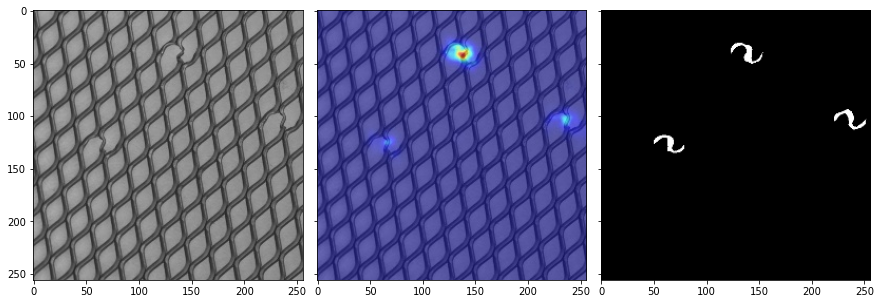
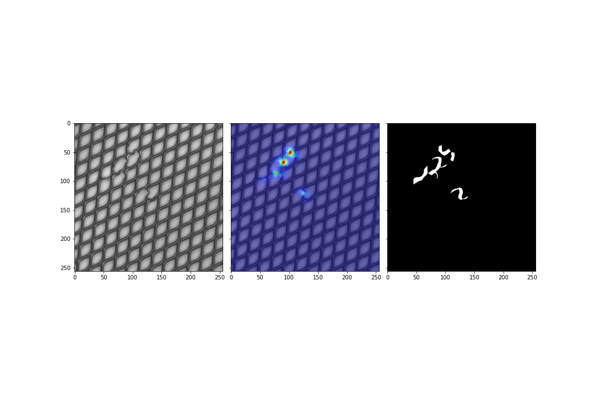
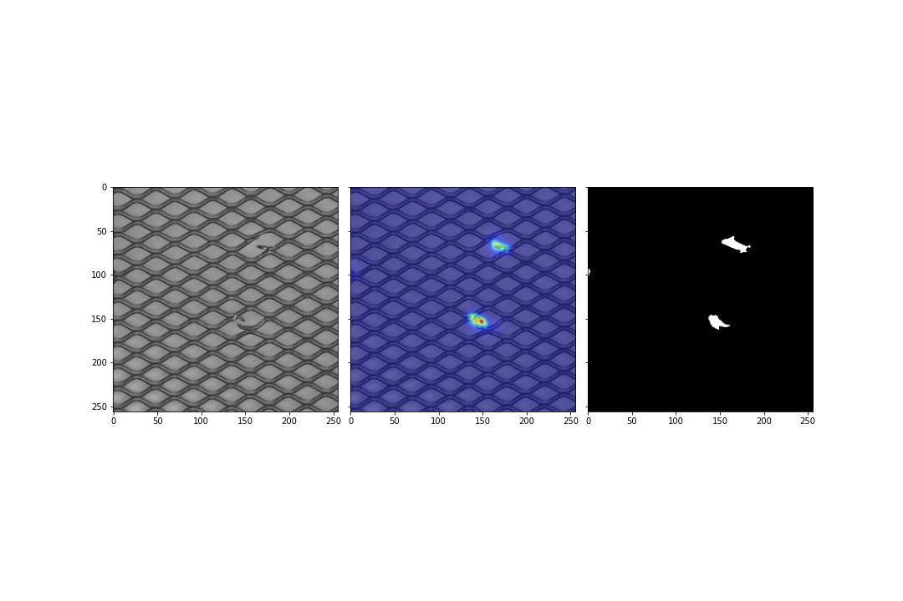
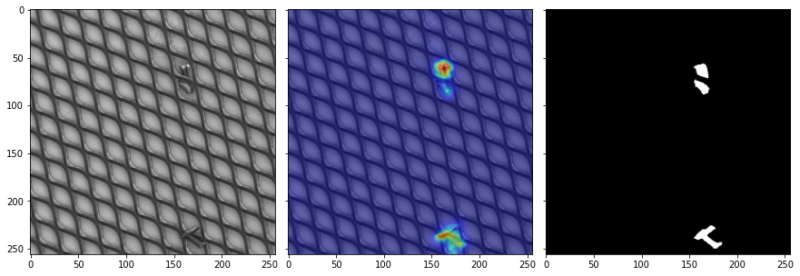
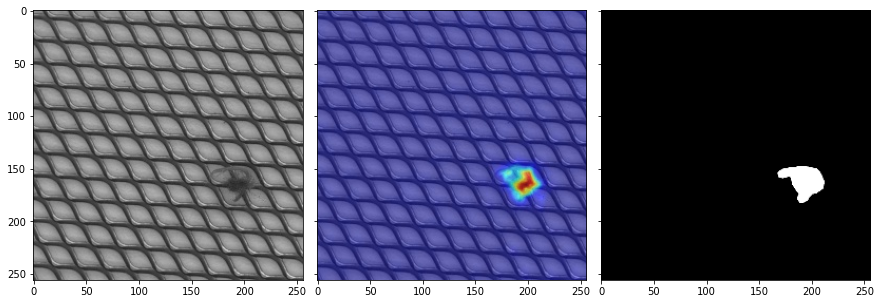
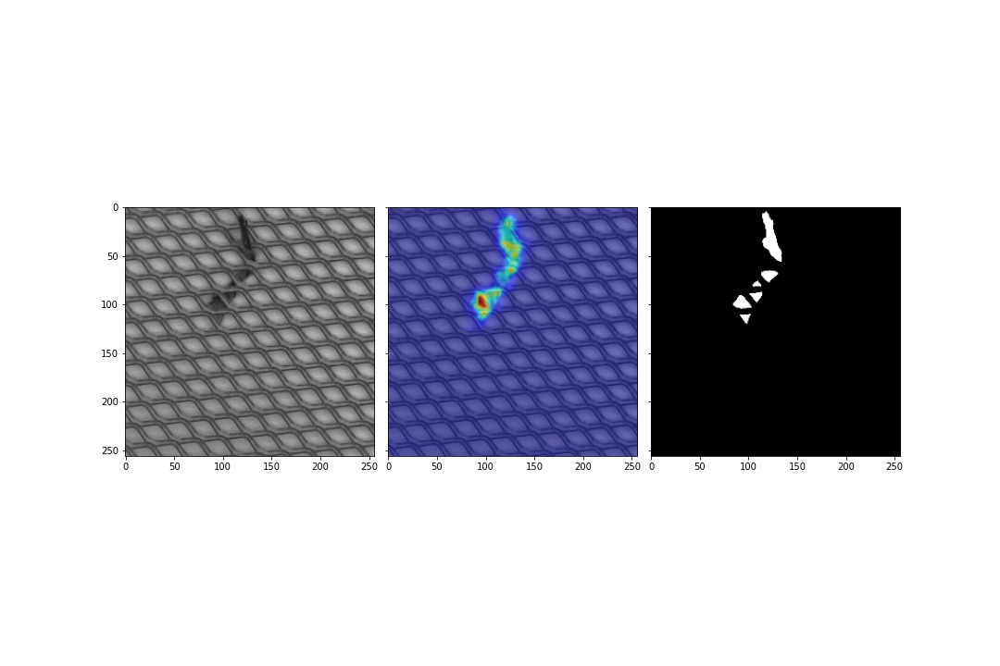

### Student-Teacher Feature Pyramid Matching for Unsupervised Anomaly Detection implementation (unofficial)
Unofficial pytorch implementation of  
Student-Teacher Feature Pyramid Matching for Unsupervised Anomaly Detection (STPM)  
\- Guodong Wang, Shumin Han, Errui Ding, Di Huang  (2021)  
https://arxiv.org/abs/2103.04257v2  

notice : This code is not official code and not verified yet. 

### Usage 
~~~
python train.py --phase 'train or test' --dataset_path '...\mvtec_anomaly_detection\bottle' --project_path 'path\to\save\results'
~~~

### MVTecAD pixel-level AUC-ROC score ~~(mean of 3 trials)~~
| Category | Original paper | This code |
| :-----: | :-: | :-: |
| carpet | 0.988 | 0.984|
| grid | 0.99 | 0.989(1)|
| leather | 0.993 | 0.976|
| tile | 0.974 | 0.907|
| wood | 0.972 | 0.856|
| bottle | 0.988 | 0.968(1)|
| cable | 0.955 | 0.519|
| capsule | 0.983 | 0.967|
| hazelnut | 0.985 | 0.903|
| metal nut | 0.976 | 0.967|
| pill | 0.978 | 0.915|
| screw | 0.983 | 0.982|
| toothbrush | 0.989 | 0.980(1) |
| transistor | 0.825 | 0.569(1)|
| zipper | 0.985 | 0.982|

Under test.    

### Localization results   

